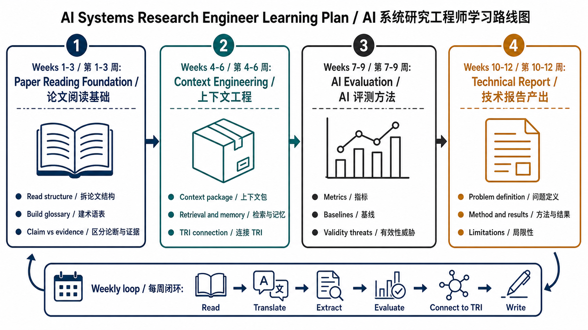

# AI Systems Research Engineer

This repository is a personal research-growth workspace for becoming an AI systems research engineer.

It is not a single research project. It stores the learning plan, mentoring contract, research routines, paper-reading method, and project cards used to train academic research ability through concrete engineering artifacts.

## Current Positioning

The current primary training track is:

```text
Context Engineering as the research topic
AI Evaluation as the research method
TRI as the first practice project
```

TRI remains an independent research project at:

```text
/Users/renjinming/code/github.com/shamcleren/tri-research-engineering
```

This repository may reference TRI, but should not absorb TRI-specific project management, claims, release rules, or patent-sensitive content.

## Roadmap / 路线图

中文：整体 12 周学习路线图如下，方便快速掌握当前训练路径。

English: The overall 12-week learning roadmap is shown below for quick orientation.



Roadmap details:

- [Roadmap overview](docs/roadmap/README.md)
- [12-week plan](docs/plans/2026-05-14-context-engineering-growth-plan.md)
- [Week 1 TODO](docs/todos/WEEK-01-TODO.md)
- [Week 2 TODO](docs/todos/WEEK-02-TODO.md)

## Baseline

- Role: senior software engineer.
- Main language: Go.
- Secondary language: Python.
- Background: observability, container platform, infrastructure, systems engineering.
- AI systems status: familiar with RAG, tool use, agents, memory, and evaluation at a conceptual level, but not yet systematized.
- Paper-reading status: no stable paper-reading habit yet.
- English-reading status: currently needs Chinese translation support for English keywords and paper text.
- Weekly time budget: more than 12 hours.
- 6-12 month target: produce paper-style technical reports and prepare toward workshop, arXiv, or patent-oriented research artifacts.

## Repository Map

```text
docs/profile/              Researcher profile and mentoring contract
docs/curriculum/           Skill map, reading tracks, and paper review method
docs/operating-system/     Weekly and monthly research routines
docs/projects/             Practice project cards
docs/plans/                Time-boxed growth plans
docs/templates/            Reusable note and experiment templates
```

## Operating Principle

Every learning cycle should produce at least one artifact:

- a structured paper note;
- a bilingual concept glossary update;
- an experiment design or critique;
- a TRI-related research note;
- a technical-report section draft.

Reading without notes, coding without evaluation, and writing without evidence do not count as completed research training.

## Bilingual Mentoring Rule

中文：后续所有 mentor-facing 内容默认使用中英双语。中文先讲清楚任务、背景和判断；英文作为 companion version，帮助逐步建立英文论文阅读能力。

English: All mentor-facing content should be bilingual by default. Chinese explains the task, context, and judgement first; English acts as a companion version to gradually build paper-reading fluency.

## Beginner Mode

中文：本仓库默认把研究训练当作从零开始。每个阶段都应该告诉我“现在要做什么、为什么做、做到什么程度算完成、完成后找你 review 什么”。

English: This repository defaults to beginner mode for research training. Each stage should explain what to do, why it matters, what counts as done, and what to ask the mentor to review afterward.
